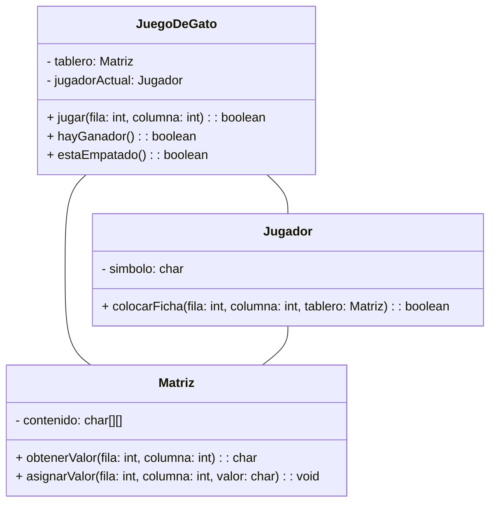

```mermaid
classDiagram
  class JuegoDeGato {
    - tablero: Matriz
    - jugadorActual: Jugador
    + jugar(fila: int, columna: int): boolean
    + hayGanador(): boolean
    + estaEmpatado(): boolean
  }

  class Jugador {
    - simbolo: char
    + colocarFicha(fila: int, columna: int, tablero: Matriz): boolean
  }

  class Matriz {
    - contenido: char[][]
    + obtenerValor(fila: int, columna: int): char
    + asignarValor(fila: int, columna: int, valor: char): void
  }

  JuegoDeGato -- Jugador
  JuegoDeGato -- Matriz
  Jugador -- Matriz

```